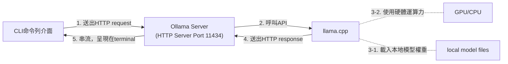

# 閱讀筆記-LLM概念

> - 資料來源：Ollama 本地 AI 全方位攻略：命令列功能、五大主題測試、RAG、Vibe Coding、MCP，一本搞定所有實戰應用 (出版社：旗標 | 施威銘研究室)
> - 閱讀日期：2026-06
> - 資料整理：蕭瑞展


## 2. 部署自建LLM概念

### 2.1 本地部署框架選擇--整合前端UI+後端推論

| 開發框發 | 下載位址 | 優劣勢 |
| --- | --- | --- |
| Ollama | https://ollama.ai/ | 客製彈性高、擴充功能大，被譽為LLM界的Docker，以描述檔(引用模型參數、模板配置、超參數)隔開封裝。<br>兼容macOS、Linux、Windows系統，免費開源，官方提供多種語言模型可下載。<br>動態分配資料給GPU的VRAM，加速與CPU的協作運算。<br>最大亮點是擁有內建REST API、Python套件、JS套件。 |
| LM Studio | https://lmstudio.ai/ | 底層結合llama.cpp引擎。<br>Apple專屬的MLX加速框架。<br>支援GGUF格式，對初學者友善。 |
| GPT4All | https://www.nomic.ai/gpt4all | 底層結合llama.cpp引擎。<br>以C++和Python為基礎開發。<br>支援從Hugging Face匯入多個模型。<br>LocalDocs是讓本地模型讀取檢索用戶的本地檔案。|
| Text Generation Web UI<br>(Oobabooga webUI) | https://github.com/oobabooga/text-generation-webui | 底層結合llama.cpp引擎、Transformers、ExLllama V2/V3，可直接加載GPTQ、GGUF等格式模型。<br>擴充外掛眾多。(如stablediffusion圖像生成) |
| LocalAI | https://localai.io/ | 底層結合llama.cpp (文字生成)、whisper (語音轉文字)、stablediffusion (圖像生成)、bark (語音生成)等後端引擎，故適合多元功能模型。<br>Golang開發，直接支援macOS、Linux系統，另裝WSL2或Docker可用於Windows。 |

### 2.2 Ollama系統架構


#### 運作機制簡述
- 前後端分離，透過CLI送出HTTP請求。(步驟1)
- 透過ModeFile建立自定義模型(客製化)，用於調整提示詞、對話格式、超參數設定、LoRA微調結果，這個檔案可匯出。(步驟3-1)

### 2.3 Ollama常用指令與快捷鍵
| 指令 | 範例 | 說明/備註 |
| --- | --- | --- |
| 下載模型檔到本地端<br>`ollama run model:version` | `ollama run gemma3:1b` | version 不寫或寫 `latest`，都是最新的模型版本。<br>若只是下載但不執行，請用 `ollama pull gemma3:1b` |
| 檢查已載或建立的模型<br>`ollama list` | `ollama list` | 包括 `ollama run model:version` 和 `/save your_chat_session` 建立儲存與於本機的模型。 |
| 顯示特定模型明細<br>`ollama show model` | `ollama show gemma3` | 顯示 Model (模型架構：參數量、上下文長度、詞嵌入維度、量化程度)、Capabilities (模型功能：如具備文字生成、語音轉文字、語音)、Parameters (超參數：溫度、top_k、top_p、stop)、License (授權：範圍、修改時刻) |
| 顯示當前執行的模型與資源分配<br>`ollama ps` | `ollama ps` | 若不完全用VRAM顯存，將在 PROCESSOR 顯示如 31%/69% CPU/GPU。 |
| 關閉模型<br>`/bye` | `/bye` | |
| 結束模型執行<br>Ctrl + d | 
| 效果與 `/bye` 相同。 |
| 複製模型<br>`ollama cp model new_model_name` | `ollama cp gemma3 new_gemma3` | |
| 用 ModeFile 建立新模型<br>`ollam create new_model_name -f "file_path"`  | `ollama create gemma3 -f "C:\Users\rjsiao\Modefile\finance_modefile.txt"` | |
|
| 移除模型<br>`ollama rm model` | `ollama rm gemma3` | |
| 多行發問<br>`""" your requests with multiple lines """` | `"""`<br>`first line`<br>`second line`<br>`"""` | 用 """ """ 包裹多行發問的內容。 |
| 清空對話紀錄<br>`/clear` | `/clear` | 重置模型對話紀錄。|
| 清空終端機畫面<br>Ctrl + l | | 不重置模型對話紀錄。 |
| 終止執行<br>Ctrl + c | | |
| 終止執行<br>`ollama stop` | `ollama stop` | |
| 儲存對話狀態<br>`/save your_chat_session` | `/save chat_translator`| 儲存歷史對話紀錄，用於角色設定、延續上下文。 |
| 載入歷史對話紀錄<br>`/load your_chat_session`<br>或 `ollama run your_chat_session` | `/load chat_translator` | 只將對話紀錄與原本模型組裝 |
| 上載外部文件到模型<br>`ollama run model:version prompt < "file_path"` | `ollama run gemma3:1b "請點列以下文件內容的重點" < "C:\Users\rjsiao\abc.txt"` | 限文字檔 |
||||

### 2.4 建立客製化模型 - Modefile

1. 撰寫自己的 Modefile (副檔名 = .txt/.py/.js)
    ```
    # 定義載入基礎模型
    FROM gemma3
    # 設定超參數
    # 採樣度(micro_stat)、上下文輸入出token數(num_ctx, num_predict)、輸出重複程度(repeat_penalty, repeat_last)與豐富度(microstat)、創意度(temperature)、固定同問項輸出(seed)、禁止輸出內容(stop)、文字接龍時區間與排序(top_k, top_p, min_p)
    PARAMETER temperature 0.6
    PARAMETER ...

    # 設定系統提示模板(角色、功能描述等)
    SYSTEM """
    你是一位專業的財務分析助手，會解釋財務報表的資料。請提供...
    """
    # 設定初始顯示的歷史對話紀錄，提高回覆穩定性。(可以多組對話紀錄)
    MESSAGE user 是否能幫我分析財務報表?
    MESSAGE assistant 可以的，請給我數據和資料。
    ```

2. 用這份 ModeFile 建立新模型：`ollam create new_model_name -f "file_path"`

### 2.5 啟用自訂環境變數
- 方法 1. 直接修改 OS 系統或使用者的環境變數
  - Windows OS (以系統管理員身分。若加上 `/M` 才能套用於全部使用者)
    ```
    setx OLLAMA_KEEP_ALIVE 5m /M
    setx OLLAMA_GPU_OVERHEAD 536870912 /M
    setx OLLAMA_DEBUG 2 /M
    ```
  - MacOS (在 `~/Library/LaunchAgent/ollama-env.plist` 的設定，才能永久生效)
    ``` Shell
    launchctl setenv OLLAMA_KEEP_ALIVE 5m
    launchctl setenv OLLAMA_GPU_OVERHEAD 536870912
    launchctl setenv OLLAMA_DEBUG 2  
    ```
- 方法 2. 新開終端機時啟用「臨時環境變數」
  - Windows OS
    ``` CMD
    set "OLLAMA_KEEP_ALIVE=5m"
    set "OLLAMA_GPU_OVERHEAD=536870912"
    set "OLLAMA_DEBUG=2"
    ollma serve
    ```
  - MacOS
    ``` Shell
    export OLLAMA_KEEP_ALIVE=5m
    export OLLAMA_GPU_OVERHEAD=536870912
    export OLLAMA_DEBUG=2
    ollama serve
    ```

### 2.6 評估硬體需求
