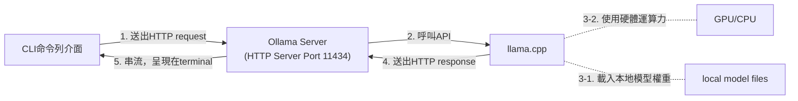

# 閱讀筆記-LLM概念

> - 資料來源：Ollama 本地 AI 全方位攻略：命令列功能、五大主題測試、RAG、Vibe Coding、MCP，一本搞定所有實戰應用 (出版社：旗標 | 施威銘研究室)
> - 閱讀日期：2026-06
> - 資料整理：蕭瑞展

## 2. 部署自建LLM概念

### 2.1 本地部署框架選擇--整合前端UI+後端推論

| 開發框發 | 下載位址 | 優劣勢 |
| --- | --- | --- |
| Ollama | https://ollama.ai/ | 客製彈性高、擴充功能大，被譽為LLM界的Docker，以描述檔(引用模型參數、模板配置、超參數)隔開封裝。 兼容macOS、Linux、Windows系統，免費開源，官方提供多種語言模型可下載。 動態分配資料給GPU的VRAM，加速與CPU的協作運算。 最大亮點是擁有內建REST API、Python套件、JS套件。 |
| LM Studio | https://lmstudio.ai/ | 底層結合llama.cpp引擎。 Apple專屬的MLX加速框架。 支援GGUF格式，對初學者友善。 |
| GPT4All | https://www.nomic.ai/gpt4all | 底層結合llama.cpp引擎。 以C++和Python為基礎開發。 支援從Hugging Face匯入多個模型。 LocalDocs是讓本地模型讀取檢索用戶的本地檔案。|
| Text Generation Web UI (Oobabooga webUI) | https://github.com/oobabooga/text-generation-webui | 底層結合llama.cpp引擎、Transformers、ExLllama V2/V3，可直接加載GPTQ、GGUF等格式模型。 擴充外掛眾多。(如stablediffusion圖像生成) |
| LocalAI | https://localai.io/ | 底層結合llama.cpp (文字生成)、whisper (語音轉文字)、stablediffusion (圖像生成)、bark (語音生成)等後端引擎，故適合多元功能模型。 Golang開發，直接支援macOS、Linux系統，另裝WSL2或Docker可用於Windows。 |

## 2.2 Ollama系統架構

#### 運作機制簡述
- 前後端分離，透過CLI送出HTTP請求。(步驟1)
- 透過ModeFile建立自定義模型(客製化)，用於調整提示詞、對話格式、超參數設定、LoRA微調結果，這個檔案可匯出。(步驟3-1)

