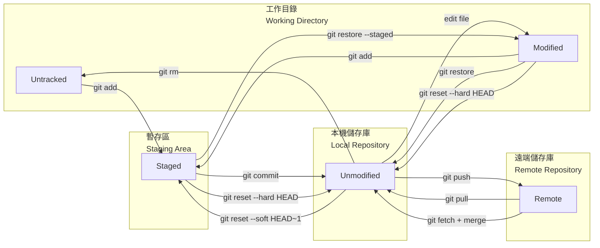

# 閱讀筆記-軟體開發版本控制

> - 資料來源 1：你的第一本Git與GitHub入門書：輕鬆實作本機與遠端儲存庫的版本控制 | 陳會安 | 博碩文化 2025-03
> - 資料來源 2：新手也能學會的Git&GitHub教科書 | たにぐち まこと、許郁文 | 碁峰 2022-07
> - 閱讀日期：2026-06
> - 資料整理：蕭瑞展
> - === 部分整理來自 個人的軟體開發的經驗 ====

## 版本控制系統 (version control system)
- 常見版控系統：Git、GitHub、SVN (subersion)、CVS (concurrent version system)、Mercurial。

- 版控架構分類

    | 架構 | 代表工具 | 儲存庫位置 | 運作方式 | 優點 | 缺點 |
    |------|----------|-----------|---------|------|------|
    | **集中式（CVCS）** | SVN、CVS | 單一中央伺服器 | 開發者 checkout 取得工作副本，commit 直接寫回中央伺服器 | 管理集中、權限控管簡單 | 中央伺服器故障即全體無法提交；需連線才能操作 |
    | **分散式（DVCS）** | Git、Mercurial | 每位開發者皆有完整儲存庫 | 本機可獨立 commit，再 push/pull 與他人同步 | 離線可工作；本機有完整歷史；分支成本低 | 概念較複雜；初次學習曲線較陡 |

    ```
    集中式（CVCS）               分散式（DVCS）

    [ 中央伺服器 ]                 [ 遠端 Remote ]
    /    |    \                   /             \
    Dev-A Dev-B Dev-C           [ Local-A ]     [ Local-B ]
    ↕     ↕     ↕               Working Dir     Working Dir
    直接commit到中央伺服器       Staging Area    Staging Area
                                Local Repo      Local Repo
    ```

- 遠端儲存庫的服務與供應商
    - GitHub (微軟)
    - GitLab (微軟 SaaS)
    - Bitbucket (Atlassian 也提供 Sourcetree, Trello, Jira, Confluence)
    - Azure (微軟 Azure DevOps)
    - Backlog (日本企業 Nulab)

- 版本控制的工作流程
    - Git Flow：依開發運維性質建立分支，如 feature/功能名、release/版本號、hotfix/作業名，不直接改動 main 分支。
    - GitHub Flow：以 Pull Request 為核心，根據主題建立分支，不直接改動 main 分支。
    - GitLab Flow：結合 Git Flow 與 GitHub Flow，加入環境分支（如 `staging`、`production`）概念，程式碼從 `main` 依序晉升到各環境分支，搭配 Merge Request 審查；適合需要多環境部署（開發→測試→正式）的團隊。
    - trunc 模式
    - Mainline 模式

### Git 版控流程、分支與合併



- **Working Directory（工作目錄）**：本地實際編輯檔案的區域，檔案狀態為 Untracked (某檔案初次提交) 或 Modified (非初次提交)。
- **Staging Area（暫存區）**：執行 `git add` 後，準備納入下次提交的變更集合，檔案狀態為 Staged。
- **Local Repository（本地儲存庫）**：執行 `git commit` 後，變更正式寫入的版本歷史紀錄，檔案狀態為 Unmodified。

- 開立分支目的：隔離開發工作。提高協同開發效率。管理不同版本。
- 衝突發生時機：多人並行開發產生 2 個分支以上，若修改相同檔案或相同程式碼時。
- **HEAD** 指標是預設指向該分支的最新提交節點。
    - **Detached HEAD**：當 HEAD 直接指向某個 commit（而非分支）時進入此狀態，通常發生於 `git checkout <sha-1>` 或 `git checkout <tag>`。此狀態下可瀏覽或實驗，但新建的 commit 不屬於任何分支，離開後將無法透過分支名稱找回。若需保留變更，應先建立新分支：`git checkout -b new-branch`。

- **Bare Repository（裸儲存庫）**：不含工作目錄的純版本歷史儲存庫，僅存放 `.git` 內部的版控資料，無法直接編輯檔案。通常作為團隊共享的遠端中央儲存庫（如 GitHub），建立後所有成員只能透過 `git push` / `git pull` 與其交換版本，無法在裸儲存庫上直接修改檔案，確保版本歷史的一致性與安全性。

- .gitignore：告訴 git 哪些檔案或資料夾**不需要納入版控**，通常用於排除機敏資訊、暫存檔、編譯產物等。
    - 建立方式：（PowerShell）`New-Item .gitignore`。（Linux / Git Bash）`touch .gitignore`
    - 常見語法：`#` 的後方放註解。`your-dir/*.log` 指定該層目錄的哪一類檔案要忽略。`lpg???.txt` 指定字元數(?=1字元)檔名要忽略。`log[0-9].txt` 指定範圍字元檔名要忽略 。`!unignorable.log` 把指定檔案保留，不可忽略。
    - 建立後需執行 `git add .gitignore` 讓規則對所有協作者生效。

### Git Flow 協同開發分支模型

```
             v1.0.0      v1.1.0            v1.2.0
main        ──●──────●────●─────────────────●──     (正式版本)
              .\    /     .                /.
hotfix        . ●──●      . release  ●────● .       (→ main + develop)
              .     \     .         /      \.
develop     ──●──────●──●─●────────●────────●───    (整合開發)
               \       /   \      
feature/A       ●──●──●     \                       (功能A開發)
                             \
feature/B                     ●──●──●               (功能B開發)
```

| 分支 | 生命週期 | 用途 | 合併目標 |
| -- | -- | -- | -- |
| `main` | 永久 | 存放正式上線的穩定版本，每個節點對應一個版本號（tag） | — |
| `develop` | 長期 | 整合所有功能的開發主線，反映下一版本的最新進度 | — |
| `feature/xxx` | 短期 | 單一功能開發，完成後合併回 develop | `develop` |
| `release/x.x` | 短期 | 從 develop 切出，只做測試與 bug 修正，不加新功能，完成後同時合併回 main 與 develop | `main` + `develop` |
| `hotfix/xxx` | 緊急短期 | 從 main 切出，修復線上緊急問題，完成後同時合併回 main 與 develop | `main` + `develop` |

- 核心原則：
    - `main` 永遠是可部署的乾淨版本。
    - 日常開發不直接動 `main`，而是透過 `develop` 匯集後再發布。
    - `hotfix` 是唯一可以跳過 `develop` 直接修 `main` 的情境。


### GitHub Flow 協同開發-提取請求

```
main        ──●──────●──●────●──────●────●────  (PR審查→merge)
               \    /    \    \    /    /
hotfix          ●──●      \    ●──●    /        (修復)
                           \          /
feature/A                   ●──●──●──●          (新功能)
```

- 導入目的：合併程式到主分支經多重檢查，增加穩定性。增強團隊溝通與協同開發。支援測試與審查流程。
- 與 Git Flow 差異：不建立 `develop`、`release` 分支；所有的新開分支皆直接源自 `main`，並且合併回到 `main`；適合持續部署（CD）的輕量協作。

- Pull Request (PR) vs. Merge Request (MR)：同一功能，不同平台的名稱。GitHub / Bitbucket 稱 PR（強調請對方把變更 pull 進來）；GitLab 稱 MR（強調把分支 merge 進目標分支）。兩者的流程完全相同。

- Pull Request 合併步驟：
    1. 從 `main` 建立功能分支：`git checkout -b feature/xxx`
    2. 開發完成後推送至遠端：`git push origin feature/xxx`
    3. 在 GitHub 上開啟 Pull Request（選擇 base: `main` ← compare: `feature/xxx`）
    4. 填寫 PR 標題與說明，指派 Reviewers
    5. Reviewers 審查程式碼，留下評論或要求修改（Request changes）
    6. 開發者依回饋修改並補推送 commit，PR 自動更新
    7. 審查通過（Approve）後，點擊 **Merge pull request** 合併進 `main`
    8. 合併後刪除功能分支（GitHub 上可直接點 Delete branch）


### Git 合併策略 (Merge Strategy in Git)

PR / MR 介面提供三種合併按鈕，對應不同的 git 策略：

| PR / MR 操作 | 對應指令 | 說明 |
| -- | -- | -- |
| **Merge commit** | `git merge --no-ff branch-name` | 強制產生合併 commit，即使可 fast-forward 也保留分支合併節點。兩分支有分叉時，Git 自動採用 Three-way Merge：找到共同祖先（base），比對雙方與 base 的差異後整合。Git Flow 常用，可明確追蹤每次功能合併時間點。 |
| **Squash and merge** | `git merge --squash branch-name` | 把功能分支所有 commit 壓縮成一筆後合併，不保留原始 commit 歷史。適合開發時 commit 零碎、合併進 `main` 只想留一筆乾淨紀錄。GitHub Flow 常用。 |
| **Rebase and merge** | `git rebase main` | 把功能分支的 commit 逐一重置到 `main` 頂端，產生線性歷史紀錄，也不建立合併 commit。<br>注意！已推送的分支不應 rebase（會重寫歷史，影響其他協作者）。 |

- Git 2.34+ 預設使用 **ORT 演算法**（取代舊版 recursive）執行上述合併，速度更快、複雜交叉歷史的衝突誤判更少，日常無需手動指定。

- 把本機多筆 commit 合併為一筆（互動式 rebase）：
    ```bash
    git rebase -i HEAD~3    # 合併最近 3 筆，數字依需求調整
    ```
    編輯器開啟後，保留第一行 `pick`，其餘改為 `squash`（或縮寫 `s`），存檔後再編輯合併的 commit 訊息。
    ```
    pick a1b2c3 first commit
    squash d4e5f6 second commit   # ← 改 pick 為 squash
    squash g7h8i9 third commit    # ← 改 pick 為 squash
    ```
    | 情境 | 說明 |
    | -- | -- |
    | 本機未推送的 commit | 安全，直接使用 |
    | 已推送到遠端 | 需補 `git push --force-with-lease`（比 `--force` 安全，遠端有新 commit 時會拒絕，避免覆蓋他人工作） |
    | GitHub PR 介面 | 直接選 **Squash and merge**，不需手動 rebase |

- `git rebase -i` 各指令說明：

    | 指令 | 縮寫 | 用途 |
    | -- | -- | -- |
    | `pick` | `p` | 保留此 commit（預設） |
    | `squash` | `s` | 合併進前一筆，合併 commit 訊息 |
    | `fixup` | `f` | 合併進前一筆，**捨棄**此筆訊息 |
    | `reword` | `r` | 保留 commit，但修改訊息 |
    | `edit` | `e` | 暫停在此筆，可修改檔案內容後再 `git rebase --continue` |
    | `drop` | `d` | 刪除此 commit |

- Patch：將 commit 差異匯出為獨立檔案，適合無法直接 push/pull 的情境（網路隔離、跨 repo 移植、傳給不用 Git 的人）。

    | | `git diff` + `patch` | `git format-patch` + `git am` |
    | -- | -- | -- |
    | 工具 | Unix 通用 `patch` 指令 | Git 原生指令 |
    | 保留 commit 訊息 | 否，只有程式碼差異 | 是（作者、時間、訊息全保留） |
    | 適用對象 | 任何文字檔，不限 Git 專案 | 僅限 Git repo |

    ```bash
    # 產生 patch（舊 → 新，HEAD^^ 是祖父、HEAD^ 是父）
    git diff HEAD^^ HEAD^ > ../patch.diff
    # 套用 patch
    patch < ../patch.diff

    # Git 原生：產生最近 3 筆 commit 的 patch 檔
    git format-patch HEAD~3
    # 套用
    git am 0001-fix-something.patch
    ```
    > `git diff A B` 是 A → B 的變化，寫反成 `HEAD^ HEAD^^` 會得到反向 diff，套用時變成撤銷該筆變更。

### 常用 git 指令一覽表

| git 指令 | 說明 | 備註 |
| -- | -- | -- |
| 初始化本地儲存庫、設定環境變數 | | |
| `git init` | 產生 .git 檔案 | |
| `git config --global user.name "Your-Name"` | 設定全域使用者名稱 | 寫入 `~/.gitconfig`，所有 repo 共用 |
| `git config --global user.email "you@example.com"` | 設定全域使用者信箱 | commit 紀錄中顯示的 email |
| `git config --local user.name "Your-Name"` | 設定單一 repo 使用者名稱 | 寫入 `.git/config`，僅對當前 repo 生效，優先於 global |
| `git config --list` | 查看目前所有 config 設定值 | 加 `--global` 只看全域設定 |
|||
| 連結本地與雲端分支 | | |
| `git clone https-url` | 複製完整副本到本機電腦 | 包括 commit 歷史紀錄、分支、repo 子目錄。|
| `git pull origin main` (下方 1. + 2. + 3.) | 一步完成，抓取並合併當前分支對應的遠端分支 | 直接把遠端併入本地，無法中途檢查 |
| 1. `git fetch origin` | 下載更新，但不會自動合併 | origin 是遠端儲存庫 |
| 2. `git diff origin/main` | 比對當前的 (通常是 main) 與遠端 main 分支差異。若差異沒問題，可用 3. `git merge origin/main` 將遠端變更併入到本機 (通常是 main)。 | origin 是遠端儲存庫 |
| `git push --set-upstream origin main` | 設定上游(雲端)分支為 origin/main，讓提取、推送指令簡化為 `git pull` 和 `git push`。 | |
| 查詢推送遠端 repo 後狀態 | | |
| `git log` | 取得目前已提交的歷程紀錄 | 若提交紀錄過長，將以查閱模式顯示，按下Q鍵能離開。<br>只取前五筆紀錄：`git log -5` |
| `git log -all` | 檢視提交歷程 | |
| `git log --oneline` | 取得目前已提交的歷程紀錄，以單行顯示 | |
| `git log --oneline --graph` | 取得目前已提交的歷程紀錄，以路徑圖顯示 | | 
| `git branch` | 顯示當前地端分支清單 | 列出中有*開頭，表示當前的分支 |
| `git branch -r` | 顯示當前雲端分支清單 | 同時列出雲端、地端分支：`git branch -a` |
| `git branch -m branch-name new-branch` | 重新命名分支名稱 | |
| `git branch --merged` | 只顯示已併入分支 | |
| 查詢推送遠端 repo 前狀態 | | |
| `git ls-files -s` | 查詢所有被 git 追蹤的檔案，版本建立的唯一sha-1識別碼 | |
| `git status` | 取得當前檔案狀態 | 包括 untracked、modified |
| `git diff HEAD` | 比對工作目錄與暫存區相對於 HEAD 的所有差異 (staged + unstaged 全包) | 相當於 `git diff` + `git diff --cached` 的總和 |
| `git diff --cached` | 比對暫存區與 HEAD 的差異 | `git diff --staged` 為同義詞 |
| `git diff` | 比對工作目錄與暫存區的差異 (尚未 git add 的變更) | |
| `git diff sha-former sha-later` | 比對兩次提交 | |
| 異動檔案的修改後或提交前狀態 | | |
| `git rm --cached file-name` | 把指定檔案移除追蹤 | |
| `git reset file-name` | 把指定檔案移出暫存區，退回 untracked 或 modified 狀態。 | 當前全數檔案都移出暫存區：`git reset` |
| `git restore file-name` | 捨棄工作目錄中的修改(modified)，將檔案還原到最近一次 commit 的狀態(unmodified)。 | Git 2.23+ 推薦用法，取代 `git checkout -- file-name`。全部還原：`git restore .` |
| `git restore --staged file-name` | 把指定檔案移出暫存區(unstaged)，但保留工作目錄的修改(modified)。 | 取代 `git reset file-name`；與 `git restore`（不加 `--staged`）搭配可分兩步撤銷 |
| `git add file-name` | 把檔案加入暫存區 | 當前全數檔案都移入暫存區：`git add`。<br>只把已修改移入暫存區：`git add -u`。 |
| `git commit -m "commit-msg"`| 提交 commit | 加入暫存並同時提交該檔：`git commit -am "commit-msg"` |
| 暫時迴避已修改檔案 |||
| `git stash save "temp" -u` | 讓修改的內容暫存到 stash ||
| `git stash list` | 列出所有暫存的 stash | 顯示格式 `stash@{num}` |
| `git stash apply stash@{num}` | 套用指定的暫存 stash | 套用最新的暫存 stash：`git stash apply`。後續直接提交可用：`git commit -am "commit-msg"` |
| `git stash dro stash@{num}` | 刪除指定的暫存 stash | 刪除最新的暫存 stash：`git stash drop`。清除所有：`git stash clear`。|
| 修正已提交 commit |||
| `git commit --amend` | 異動最新一次提交的訊息。限推送 git push 之前！ | 若要補上檔案或調整檔案，可先 `git add other-files`，再執行這個指令即可補上其他檔案。|
| `git commit -a --amend --no-edit` | 利用 ammend 新增提交檔案 | --no-edit 將禁止編輯器啟動。 |
| `git reset --soft sha-1` | 把 HEAD 移回指定 commit，**保留**暫存區與工作目錄的所有變更 | 適合「撤銷 commit 但保留修改，準備重新整理後再提交」 |
| `git reset --hard sha-1` | 把 HEAD 移回指定 commit，**清除**暫存區與工作目錄的所有變更 | 無法復原，僅影響已追蹤檔案 |
| `git reset --hard HEAD` | 捨棄所有暫存區與工作目錄的修改，還原到最近一次 commit 狀態 | 同時清除 Staged 與 Modified，無法復原；僅影響已追蹤檔案，Untracked 檔案不受影響 |
| `git revert sha-1 --no-edit` | 建立一個新 commit 來反轉指定 commit 的變更，不開啟編輯器 | **不重寫歷史**，安全用於已推送的分支；`--no-edit` 沿用預設 revert 訊息。若有衝突，解衝突後 `git add file-name` 再 `git revert --continue` |
| `git cherry-pick sha-1` | 把指定 commit 的變更套用到當前分支，產生一筆新 commit | 適合從其他分支摘取單一修正。連續範圍：`git cherry-pick sha-A..sha-B`。衝突時解決後 `git add file-name` 再下 `git cherry-pick --continue`，放棄：`git cherry-pick --abort` |
| 合併分支與解衝突 | | |
| `git checkout branch-name` | 切換到另一分支 | |
| `git checkout -b branch-name` | 新增並切換到另一分支 | 從當前節點開始 |
| `git merge branch-name -m "commit-msg"` | 把指定分支合併到當前分支。若出現衝突，需逐列解決後再 `git add` + `git commit`。放棄合併：`git merge --abort`。 | 自動生成合併訊息： `git merge branch-name --no-edit`，格式為 `Merge branch 'xxx' into yyy`。 |
| `git rebase main` 或 `git rebase master` | 把當前分支重置到指定分支上。若出現衝突，需逐列解決後再 `git add` + `git commit`。 | 產生線性化的提交歷史紀錄。 |
| `git branch -d branch-name` | 刪除本地分支 | 主要是刪除已併入main的分支，但不能刪除 main。|
| `git branch -D branch-name` | 強制刪除本地分支 | 主要是刪除未併入main的分支。|
| `git push origin --delete branch-name` | 刪除遠端分支 | 本地分支仍保留，需另外用 `git branch -d` 刪除。|
| 標記版本（Tag） | | |
| `git tag` | 列出所有本地 tag | |
| `git tag v1.0.0` | 在當前 commit 建立輕量標籤（lightweight tag） | 只是一個指向 commit 的指標，不含額外資訊 |
| `git tag -a v1.0.0 -m "release-msg"` | 建立附註標籤（annotated tag） | 含作者、日期、訊息，適合正式版本發布 |
| `git tag -a v1.0.0 sha-1` | 在指定 commit 建立附註標籤 | 補標記歷史 commit |
| `git show v1.0.0` | 查看指定 tag 的詳細資訊 | |
| `git push origin v1.0.0` | 推送單一 tag 到遠端 | tag 預設不會隨 `git push` 一起推送 |
| `git push origin --tags` | 推送所有本地 tag 到遠端 | |
| `git tag -d v1.0.0` | 刪除本地 tag | |
| `git push origin --delete v1.0.0` | 刪除遠端 tag | |

### 常用 OS 指令一覽表

| MS-DOS Windows PowerShell 指令 | 說明 | 備註 (Linux BASh 等效指令) |
| -- | -- | -- |
| `wsl` | 啟動 Windows 的 Linux 子系統 | 透過 MS Store 安裝 WSL2 之後 (微軟在 2017 年推出 WSL) |
| `Set-Location \` 或 `cd \` | 切回根目錄 | `cd` 或 `cd ~` |
| `cd D:\` | 切回指定目錄 | `cd dir-name` |
| `clear` | 清除終端機文字訊息 | `clear` |
| `dir` | 顯示當前目錄內含檔案 | `ls` |
| `ls` 或 `ls -al` | 顯示當前目錄的檔案資訊 | `ls` |
| `dir *.txt` | 指定當前目錄指定檔名的檔案資訊 | `ls *.txt` | 
| `echo "your-texts" > file-name` | 建立文字檔案 | `touch` |
| `type file-name` | 顯示文字檔案內容 | `cat file-name`（中文內文在 Windows 終端機可能產生亂碼） |
| `move file-name new-file-path` | 移動檔案到新目錄 | `mv file-name new-file-path` |
| `copy file-name new-file-path` | 複製檔案 | `cp file-name new-file-path` |
| `ren file-name new-file-name` | 變更新檔名 | `mv file-name new-file-name` |
| `del file-name` 或 `erase file-name` | 刪除檔案 | `rm file-name` |
| `mkdir dir-name` | 建立新目錄 | `mkdir dir-name` |
| `xcopy dir-name new-dir` | 複製目錄及下方的所有檔案 | `cp -r dir-name new-dir` |
| `rmdir dir-name` | 刪除空目錄 | `rmdir dir-name` |
| `Remove-Item -Path "dir-name" -Recurse -Force` | 強制刪除該目錄及下方的所有檔案 | `sudo rm -rf dir-name` |
| `New-Item .gitignore` | 建立可忽略檔案的規則清單 | `touch .gitignore` | 
| `git --version` | 查看 Git 版本 | |