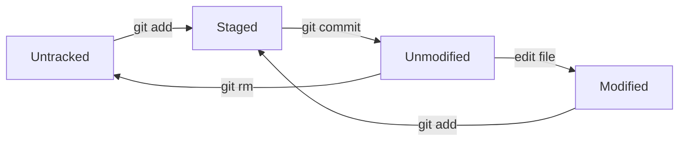

### Git 版控流程、分支與合併

- **Working Directory（工作目錄）**：本地實際編輯檔案的區域，檔案狀態為 Untracked (某檔案初次提交) 或 Modified (非初次提交)。
- **Staging Area（暫存區）**：執行 `git add` 後，準備納入下次提交的變更集合，檔案狀態為 Staged。
- **Local Repository（本地儲存庫）**：執行 `git commit` 後，變更正式寫入的版本歷史紀錄，檔案狀態為 Unmodified。

- 開立分支目的：隔離開發工作。提高協同開發效率。管理不同版本。
- 衝突發生時機：多人並行開發產生 2 個分支以上，若修改相同檔案或相同程式碼時。
- HEAD 預設指向該分支的最新提交節點。

| git 指令 | 說明 | 備註 |
| -- | -- | -- |
| 初始化本地儲存庫 | | |
| `git init` | 產生 .git 檔案 | |
| 查詢推送遠端 repo 後狀態 | | |
| `git log` | 取得目前已提交的歷程紀錄 | 若提交紀錄過長，將以查閱模式顯示，按下Q鍵能離開。 只取前五筆紀錄：`git log -5` |
| `git log --oneline` | 取得目前已提交的歷程紀錄，以單行顯示 | |
| `git log --oneline --graph` | 取得目前已提交的歷程紀錄，以路徑圖顯示 | |
| `git branch` | 顯示當前地端分支清單 | 列出中有*開頭，表示當前的分支 |
| `git branch --merged` | 只顯示已併入分支 | |
| 查詢推送遠端 repo 前狀態 | | |
| `git ls-files` | 查詢所有被 git 追蹤的檔案 | |
| `git status` | 取得當前檔案狀態 | 包括 untracked、modified |
| `git diff --staged` | 比對暫存區檔案中的變更 | |
| `git diff` | 比對已修改檔案中的變更 | |
| `git diff sha-former sha-later` | 比對兩次提交 | |
| 異動檔案的修改後或提交前狀態 | | |
| `git rm --cached file-name` | 把指定檔案移除追蹤 | |
| `git reset file-name` | 把指定檔案移出暫存區，退回 untracked 或 modified 狀態。 | 當前全數檔案都移出暫存區：`git reset` |
| `git reset --hard sha-1` | 回復指定的提交節點狀態 | |
| `git add file-name` | 把檔案加入暫存區 | 當前全數檔案都移入暫存區：`git add`。 只把已修改移入暫存區：`git add -u`。 |
| `git commit -m "commit-msg"`| 提交 commit | 加入暫存並同時提交該檔：`git commit -am "commit-msg"` |
| 合併分支與解衝突 | | |
| `git checkout branch-name` | 切換到另一分支 | |
| `git checkout -b branch-name` | 新增並切換到另一分支 | 從當前節點開始 |
| `git marge branch-name -m "commit-msg"` | 把指定分支合併到當前分支 | 若出現衝突，要先逐列解決。 |
| `git branch -d branch-name` | 刪除本地分支 | 主要是刪除已併入main的分支，但不能刪除 main。|
| `git branch -D branch-name` | 強制刪除本地分支 | 主要是刪除未併入main的分支。|

| Windows PowerShell 指令 | 說明 | 備註 (Linux bash 等效指令) |
| -- | -- | -- |
| `type file-name` | 顯示檔案內容 | 中文內文會產生亂碼 |
| `copy file-name new-file-name` | 複製檔案 | `cp file-name new-file-name` |