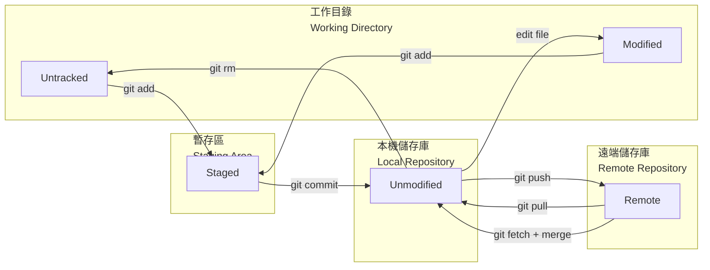

### Git 版控流程、分支與合併

- **Working Directory（工作目錄）**：本地實際編輯檔案的區域，檔案狀態為 Untracked (某檔案初次提交) 或 Modified (非初次提交)。
- **Staging Area（暫存區）**：執行 `git add` 後，準備納入下次提交的變更集合，檔案狀態為 Staged。
- **Local Repository（本地儲存庫）**：執行 `git commit` 後，變更正式寫入的版本歷史紀錄，檔案狀態為 Unmodified。

- 開立分支目的：隔離開發工作。提高協同開發效率。管理不同版本。
- 衝突發生時機：多人並行開發產生 2 個分支以上，若修改相同檔案或相同程式碼時。
- HEAD 預設指向該分支的最新提交節點。

- **Bare Repository（裸儲存庫）**：不含工作目錄的純版本歷史儲存庫，僅存放 `.git` 內部的版控資料，無法直接編輯檔案。通常作為團隊共享的遠端中央儲存庫（如 GitHub），建立後所有成員只能透過 `git push` / `git pull` 與其交換版本，無法在裸儲存庫上直接修改檔案，確保版本歷史的一致性與安全性。

- .gitignore：告訴 git 哪些檔案或資料夾**不需要納入版控**，通常用於排除機敏資訊、暫存檔、編譯產物等。
    - 建立方式：（PowerShell）`New-Item .gitignore`。（Linux / Git Bash）`touch .gitignore`
    - 常見語法：`#` 的後方放註解。`your-dir/*.log` 指定該層目錄的哪一類檔案要忽略。`!unignorable.log` 把指定檔案保留，不可忽略。
    - 建立後需執行 `git add .gitignore` 讓規則對所有協作者生效。

| git 指令 | 說明 | 備註 |
| -- | -- | -- |
| 初始化本地儲存庫 | | |
| `git init` | 產生 .git 檔案 | |
| 連結本地與雲端分支 | | |
| `git clone https-url` | 複製完整副本到本機電腦 | 包括 commit 歷史紀錄、分支、repo 子目錄。|
| `git pull origin main` (下方 1. + 2. + 3.) | 一步完成，抓取並合併當前分支對應的遠端分支 | 直接把遠端併入本地，無法中途檢查 |
| 1. `git fetch origin` | 下載更新，但不會自動合併 | origin 是遠端儲存庫 |
| 2. `git diff origin/main` | 比對當前的 (通常是 main) 與遠端 main 分支差異。若差異沒問題，可用 3. `git merge origin/main` 將遠端變更併入到本機 (通常是 main)。 | origin 是遠端儲存庫 |
| `git push --set-upstream origin main` | 設定上游(雲端)分支為 origin/main，讓提取、推送指令簡化為 `git pull` 和 `git push`。 | |
| 查詢推送遠端 repo 後狀態 | | |
| `git log` | 取得目前已提交的歷程紀錄 | 若提交紀錄過長，將以查閱模式顯示，按下Q鍵能離開。 只取前五筆紀錄：`git log -5` |
| `git log --oneline` | 取得目前已提交的歷程紀錄，以單行顯示 | |
| `git log --oneline --graph` | 取得目前已提交的歷程紀錄，以路徑圖顯示 | | 
| `git branch` | 顯示當前地端分支清單 | 列出中有*開頭，表示當前的分支 |
| `git branch -r` | 顯示當前雲端分支清單 | 同時列出雲端、地端分支：`git branch -a` |
| `git branch --merged` | 只顯示已併入分支 | |
| 查詢推送遠端 repo 前狀態 | | |
| `git ls-files` | 查詢所有被 git 追蹤的檔案 | |
| `git status` | 取得當前檔案狀態 | 包括 untracked、modified |
| `git diff --staged` | 比對暫存區檔案中的變更 | |
| `git diff` | 比對已修改檔案中的變更 | |
| `git diff sha-former sha-later` | 比對兩次提交 | |
| 異動檔案的修改後或提交前狀態 | | |
| `git rm --cached file-name` | 把指定檔案移除追蹤 | |
| `git reset file-name` | 把指定檔案移出暫存區，退回 untracked 或 modified 狀態。 | 當前全數檔案都移出暫存區：`git reset` |
| `git reset --hard sha-1` | 回復指定的提交節點狀態 | |
| `git add file-name` | 把檔案加入暫存區 | 當前全數檔案都移入暫存區：`git add`。 只把已修改移入暫存區：`git add -u`。 |
| `git commit -m "commit-msg"`| 提交 commit | 加入暫存並同時提交該檔：`git commit -am "commit-msg"` |
| 合併分支與解衝突 | | |
| `git checkout branch-name` | 切換到另一分支 | |
| `git checkout -b branch-name` | 新增並切換到另一分支 | 從當前節點開始 |
| `git marge branch-name -m "commit-msg"` | 把指定分支合併到當前分支 | 若出現衝突，要先逐列解決。 |
| `git branch -d branch-name` | 刪除本地分支 | 主要是刪除已併入main的分支，但不能刪除 main。|
| `git branch -D branch-name` | 強制刪除本地分支 | 主要是刪除未併入main的分支。|
| `git push origin --delete branch-name` | 刪除遠端分支 | 本地分支仍保留，需另外用 `git branch -d` 刪除。|
| 標記版本（Tag） | | |
| `git tag` | 列出所有本地 tag | |
| `git tag v1.0.0` | 在當前 commit 建立輕量標籤（lightweight tag） | 只是一個指向 commit 的指標，不含額外資訊 |
| `git tag -a v1.0.0 -m "release-msg"` | 建立附註標籤（annotated tag） | 含作者、日期、訊息，適合正式版本發布 |
| `git tag -a v1.0.0 sha-1` | 在指定 commit 建立附註標籤 | 補標記歷史 commit |
| `git show v1.0.0` | 查看指定 tag 的詳細資訊 | |
| `git push origin v1.0.0` | 推送單一 tag 到遠端 | tag 預設不會隨 `git push` 一起推送 |
| `git push origin --tags` | 推送所有本地 tag 到遠端 | |
| `git tag -d v1.0.0` | 刪除本地 tag | |
| `git push origin --delete v1.0.0` | 刪除遠端 tag | |

| Windows PowerShell 指令 | 說明 | 備註 (Linux bash 等效指令) |
| -- | -- | -- |
| `type file-name` | 顯示檔案內容 | 中文內文會產生亂碼 |
| `copy file-name new-file-name` | 複製檔案 | `cp file-name new-file-name` |
| `New-Item .gitignore` | 建立可忽略檔案的規則清單 | `touch .gitignore` | 