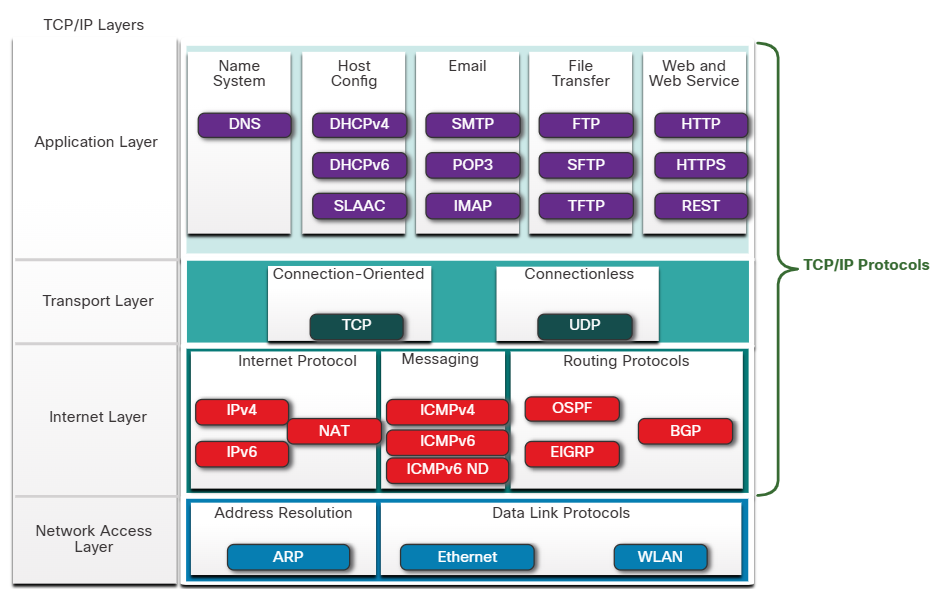

# 閱讀筆記 > 資安與網路 > 3.網架架構

> **References**
> - Module 5. Network Protocols. CyberOps Associate Training from Cisco Networking Academy.
> - Module 6. Ethernet and Internet Protocol. CyberOps Associate Training from Cisco Networking Academy.
> - Module 7. Connectivity Verification. CyberOps Associate Training from Cisco Networking Academy.
> - Module 8. Address Resolution Protocol. CyberOps Associate Training from Cisco Networking Academy.
> - Module 16. Attacking the Foundation. CyberOps Associate Training from Cisco Networking Academy. 

## 3-1. 實體網路架構
- 網路種類
    - **Peer-to-Peer Network**：每台電腦同時作為伺服器與客戶端
    - **Small Home Network**：家庭內少數電腦互連並接入網際網路
    - **SOHO (Small Office/Home Office) Network**：小型辦公室或居家辦公連接公司資源
    - **Medium to Large Networks**：企業或學校使用，包含數百到數千台設備
    - **World Wide Networks (Internet)**：全球網路互連，連接數億台電腦
- Client-Server通訊
    - **Host / End Device / Node**：直接參與網路通訊的設備
    - **Server**：提供特定服務的電腦（如網頁、郵件、檔案）
    - **Client**：使用軟體存取伺服器的電腦
    - **File Server**：集中儲存檔案的伺服器
    - **Web Server**：提供網頁的伺服器
    - **Email Server**：提供電子郵件服務的伺服器
    - **Client Software**
- 網路連線路徑(童常不只一條路由)
    - **Copper / Fiber-optic cables**：傳輸資料的實體媒介
    - **Tier 1 ISP (internet service providers)**：全球骨幹網路供應商
    - **Tier 2 ISP**：區域性網路供應商
    - **Tier 3 ISP**：提供家庭與企業接入的供應商
    - **IXP (Internet Exchange Point)**：不同ISP交換流量的節點
    - **PoP (Point of Presence)**：Tier 2 ISP可與使用者網路的實體連接點

## 3-2 網路通訊協定
- 協定的定義
    - 訊息編碼
        - **Encoding (編碼)**：將資料轉換為bits
        - **Transmission Media (傳輸媒介)**：
        - **Electrical Signals (電訊號)**：在銅線中傳輸
        - **Light Waves (光訊號)**：在光纖中傳輸
        - **Radio Waves (無線電波)**：在無線網路中傳輸
        - **Decoding (解碼)**：接收端將訊號還原為資料
    - 格式與封裝
        - **Encapsulation**：將資料封裝在協定標頭中
        - **De-encapsulation**：接收端解封裝資料
        - **IP Header**：包含版本、流量類別、來源與目的 IP 等資訊
    - 大小
    - 時間
        - **Flow Control**：控制傳輸速度與資料量
        - **Response Timeout**：設定等待回應的時間
         **Access Method (CSMA, Carrier Sense Multiple Access)**：決定何時可傳送訊息
    - 傳送方式
        - **Unicast (單播)**：一對一傳輸
        - **Multicast (多播)**：一對多傳輸
        - **Broadcast (廣播)**：一對所有傳輸

- TCP/IP Protocol Suite
    

    - Application Layer
        - **DNS (Domain Name System)**：將網域名稱轉換為 IP 位址
        - **[例行] DHCPv4 (Dynamic Host Configuration Protocol for IPv4) / [例行] DHCPv6 (Dynamic Host Configuration Protocol for IPv6)**：自動分配 IPv4/IPv6 位址
        - **SLAAC (Stateless Address Autoconfiguration)**：IPv6 自動位址設定，不需 DHCP
        - **SMTP (Simple Mail Transfer Protocol)**：寄送電子郵件
        - **POP3 (Post Office Protocol version 3)**：下載郵件到本地端
        - **IMAP (Internet Message Access Protocol)**：存取並管理伺服器上的郵件
        - **FTP (File Transfer Protocol)**：檔案傳輸
        - **SFTP (SSH File Transfer Protocol)**：加密的檔案傳輸
        - **TFTP (Trivial File Transfer Protocol)**：簡單、無連線的檔案傳輸
        - **HTTP / HTTPS (HTTP Secure)**：網頁傳輸，HTTPS 為加密版本
        - **REST (Representational State Transfer)**：基於 HTTP 的 Web API 架構

    - Transport Layer
        - **TCP (Transmission Control Protocol)**：可靠、連線導向的傳輸
        - **UDP (User Datagram Protocol)**：快速、無連線的傳輸

    - Internet Layer
        - **IPv4 (Internet Protocol version 4)**：32 位元位址協定
        - **IPv6 (Internet Protocol version 6)**：128 位元位址協定
        - **NAT (Network Address Translation)**：將私有 IPv4 位址轉換為公有位址
        - **[例行] ICMPv4 (Internet Control Message Protocol for IPv4)**：提供錯誤回報與診斷
        - **[例行] ICMPv6 (Internet Control Message Protocol for IPv6)**：IPv6 的控制訊息協定
        - **[例行] ICMPv6 ND (Neighbor Discovery)**：位址解析與重複位址檢測

    - [例行] Routing Protocols (路由協定)
        - **[例行] OSPF (Open Shortest Path First)**：開放標準的鏈路狀態路由協定
        - **[例行] EIGRP (Enhanced Interior Gateway Routing Protocol)**：Cisco 專有的路由協定
        - **[例行] BGP (Border Gateway Protocol)**：ISP 之間使用的外部路由協定

    - Network Access Layer
        - **[例行] ARP (Address Resolution Protocol)**：將 IPv4 位址對應到 MAC 位址
        - **Ethernet**：有線區域網路標準
        - **WLAN (Wireless Local Area Network)**：無線區域網路標準

## 3-3. 網路模型
- OSI Model (Open Systems Interconnection, 7 Layers)
    - UPPER
    1. **Application**：應用程式通訊
    2. **Presentation**：資料表示與轉換
    3. **Session**：建立與管理會話
    4. **Transport**：可靠或不可靠的傳輸
    5. **Network**：路由與位址
    6. **Data Link**：資料封裝與傳輸
    7. **Physical**：實體媒介與訊號
    - LOWER
- TCP/IP Model (Transmission Control Protocol / Internet Protocol, 4 Layers)
    1. **[OSI L7-L5] Application**：應用程式協定 
    2. **[OSI L4] Transport**：TCP/UDP
    3. **[OSI L3] Internet**：IP與路由協定
    4. **[OSI L2-L1] Network Access**：Ethernet, WLAN

# 3-4. 資料封裝(Data Encapsulation)
- **Encapsulation (封裝)**：送出端
    - **IP (Internet Protocol) Header**：相當於信封，負責標記來源與目的 IP 位址。
        - IP Header 的欄位：
        - **Version**：IP 協定版本 (IPv4 或 IPv6)
        - **Traffic Class**：流量分類
        - **Flow Label**：流量標籤
        - **Payload Length**：資料負載長度
        - **Next Header**：下一個協定標頭 (例如 TCP 或 UDP)
        - **Hop Limit**：封包可經過的最大跳數
        - **Source IP Address**：來源 IP 位址
        - **Destination IP Address**：目的 IP 位址
- **De-encapsulation (解封裝)**：接收端

- PDU (Protocol Data Units) 以OSI說明
    1. **資料 Data** → 應用層  
    2. **資料段 Segment / Datagram** → 傳輸層(含port埠號)  
    3. **封包 Packet** → 網際網路層(含IP邏輯位址)
    4. **訊框 Frame** → 資料鏈結層(含MAC實體位址) 
    5. **位元 Bits** → 物理層轉換成訊號傳輸
    - 三地址：protocol address、network host address、physical address

> 常用字彙集

| ENG | 華語 |
| --- | --- |
| Network protocols dictate the message encoding, formatting, encapsulation, size, timing, and delivery options | 網路協定決定訊息的編碼、格式化、封裝方式、大小、時間控制，以及傳遞選項。 |
| Envelope | 信封 |
| Letter | 信件 |
| Sender Address | 寄件者位址 |
| Recipient Address | 收件者位址 |
| Salutation | 問候語 |
| End of Frame | 訊息結束指示 |

## 3-6. 乙太網路
- 使用有線網路(wired)，線材有三款：雙絞線(twisted pair)、光纖(fiber-optic links)、同軸電纜(coaxial cables)。
- 運作範圍是在OSI模型的data link layer、physical layer。協定技術相當接近IEEE 802.2、802.3標準。可對應頻寬有10、100、1000、10,000、40,000、100,000 Mbps。
- 乙太網路訊框
    - 大小規格：排除8 byte Premeable and SFD，最小64 bytes，最大1518 bytes。小於64稱作collision fragment或runt frame會被自動捨棄，大於1518稱作jumbo或baby giant frames不一定會被丟棄。
    - 訊框欄位(ethernet frame fields)

    | 計入64 bytes | 欄位 | 大小(bytes) | 用途 |
    | --- | --- | --- | --- |
    | 否 | Premeable + SFD/Start of Frame | 7 + 1 | 提醒正式訊息將到 |
    | 是 | Destination MAC Address | 6 | 儲存目的MAC位址(unicast, multicast, broadcast) |
    | 是 | Source MAC Address | 6 | 儲存來源MAC位址(限unicast) |
    | 是 | Type / Length | 2 | 辨識較高層次的協定，如IPv4用0x800，IPv6用0x86DD，ARP用0x806 |
    | 是 | Data | 46 to 1500 | 在第3層網路層封裝成封包(packet)，過小的封包會塞入pad滿足訊框最小64 bytes條件。 |
    | 是 | Frame Check Sequence (FCS) | 4 | 檢查資料是否完整傳輸。 |

- MAC位址 vs IP位址
    | 項目 | MAC位址 | IP位址 |
    | --- | --- | --- |
    | 別名 | 實體位址(physical address) | 邏輯位址(logical address) |
    | OSI階層 | Layer 2 | Layer 3 |
    | 封裝結果 | Ethernet frame | IP packet |
    | 用途 | 網路介面卡卡號(Ethernet NIC) | 辨別封包位址傳送來源和目的 |
    | 組成 | 以16進制的12位元 [0-9A-F] 表示，相當於2進制的48位元。每2位元用"-"或":"區隔，或每4位元用"."區隔。 | 分成IPv4和IPv6 |

    - 在不同網段間的傳輸，IP位址來源、目的不改變，但MAC位址在不同段主機間會不斷透過解封裝、封裝改變內容。

- OSI Layer 3網路層
    - IPv4, IPv6, OSPF, ICMP
    - IP四大基本功能：加註地址、封裝、路由(會經過多個hop)、解封裝。
    - IP三大特徵：非連接(Connectionless), 盡力服務(Best Effort), 媒體獨立性(Media Independent)。
    - IP packets can be communicated as electronic signals over copper cable, as optical signals over fiber, or wirelessly as radio signals.
    - 最大傳輸單元(maximum transmission unit, MTU)：傳輸媒介可傳遞PDU的最大值。部分中間路由裝置會分割IPv4封包稱作分割(fragmentation)，導致延遲(latency)。IPv4封包無法被分割。
    - 透過網際網路協議套組(TCP/IP protocol suite, IPS)解決可靠性問題，此功能要在OSI Layer 4傳輸層實現。

> 常用字彙集

| 華語 | ENG |
| --- | --- |
| 這一模組始於 ... 討論 | This module starts with a discussion of ... |
| 侏儒訊框自動被接收站捨棄 | runt frame is automatically discarded by receiving stations |
| 接收端裝置丟棄訊框 | receiving device drops the frame |
| 被認為無效的。 | are considered invalid. |
| 發送端與接收端裝置同步 | synchronization bwtween the sending and receiving devices |
| 要接收節點注意 | get attention of the receiving nodes |
| 協助裝置辨別... | assist devices in determining if ... |
| 6位元組是... | This 6-byte field identifies ... |
| 網路卡 | Network Interface Card (NIC) |
| 解析乙太網路資料 | interpret the Ethernet data |
| 協助主機判斷...是否... | assists a host in determining if ... |
| 幫助目的主機偵測...是否... | helps a destination detect if ... | 
| 跨越連線邊界達成端點對端點溝通 | accomplish end-to-end communications across network boundaries |
| 標註地址 | address end devices |
| 加上IP標頭資訊，如來源端和目的端主機的IP位址  | adds IP header information, such as the IP address of the source (sending) and destination (receiving) hosts |
| 選擇最佳路徑，並導引封包到另一網路的目的主機 | select the best path and direct the packets to a destination host on another network |
| IP以加上IP標頭來封裝片段或資料。 | IP encapsulates the segment or other data by adding an IP header. |
| 傳遞封包到目的主機 | deliver the packet to the destination host |
| 片段可被輕易地IPv4或IPv6包裝 | segments can be readily packaged by IPv4 or IPv6 |
| 重要的是要提醒... 不過除了當... | It is important to note, that ..., except ... |
| 第三層裝置意即路由器和交換器 | Layer 3 devices (i.e., routers and Layer 3 switches) |
| 中間裝置, 終端裝置, 目標裝置 | intermediary devices, end devices, destination devices |
| 在網路層處理過程保持不變 | remains unchanged during the network layer processes |
| A 換句話說叫 B | A, that is, B |
| 封包的資料部分 | the data portion of the packet |
| IP是設計成低營運成本的協定。 | IP was designed as a protocol with low overhead. |
| 此程序大幅減少營運開支 | This process greatly reduces the overhead |
| 運作與攜帶資料媒體互相獨立。| Operation is independent of the medium carrying the data. |
| IP本質上是不可靠的 | IP is inherently unreliable |
| 沒有專用的點對點連線被建立 | no dedicated end-to-end connection is created |
| 沒有事前通知收件者 | without notifying the recipient in advance. |
| 執行相同原則 | work on the same principle. 
| 封包可能在到達時已被損毀、排序異常、沒有傳到。 | Packets may arrive at the destination corrupted, out of sequence, or not at all. |
| 網際網路協議套組 | TCP/IP protocol suite (IPS) |
| IP封包可被傳輸，透過銅線的電子訊號、光纖的光學訊號、無線電訊號 | IP packets can be communicated as electronic signals over copper cable, as optical signals over fiber, or wirelessly as radio signals. |
| 傳送不局限於任一特定媒介 | the delivery is not limited to any particular medium. |
| 這個特徵被認為是MTU。 | This characteristic is referred to as the maximum transmission unit (MTU). |
| A由B組成。 | A be made up of B. A be composed of B. A consist of B |
| 許多過程在執行中 | numerous processes are at work |
| 協定如何讓網路運作 | how protocols enable network operations |
| 資訊隱藏 | data encapsulation  |

## 3-7. IPv4、IPv6封包標頭模組
- 檢視封包：用WireShark

- IPv4標頭
    - 驗證封包：IHL、Total Length、Header Checksum。
    - 追蹤片段：Identification、Flag、Fragment Offset。
    - 傳輸過程允許路由器分割過大的封包。
<table border="2" >
    <tr>
        <th>Byte 1</th>
        <th>Byte 2</th>
        <th>Byte 3</th>
        <th>Byte 4</th>
    </tr>
    <tr>
        <td>版本(0100)+ IHL(此Header長度)</td>
        <td>DiffServ/ToS (封包優先序) (= DSCP+ECN)</td>
        <td colspan="2">Total Length</td>
    </tr>
    <tr>
        <td colspan="2">ID (相同資料)</td>
        <td>Flag (O-D-M三碼)</td>
        <td>Fragment offset (資料排序用)</td>
    </tr>
    <tr>
        <td>Time-to-Live (TTL，封包每經一個router後-1，直到0後遭路由丟棄。)</td>
        <td>L4協定代號(ICMP=1, TCP=6, UDP=17)</td>
        <td colspan="2">checksum(封包完整性)</td>
    </tr>
    <tr>
        <td colspan="4">來源IP位址(限unicast)</td>
    </tr>
    <tr>
        <td colspan="4">目的IP位址(unicast, multicast, or broadcast)</td>
    </tr>
        <tr>
        <td colspan="4">Options | Padding (填補至32 bits)</td>
    </tr>
</table>

- IPv6標頭
    - 注意！extension headers (EH)不屬於原本的IPv6標頭，介於IPv6標頭、資料payload之間，可存放選擇性資訊，用於資料分割、安全、移動。
    - 只允許來源主機分割資料，分割封包用Fragment Header，接續的傳輸過程都不允許路由器分割封包。若封包太大無法傳送，該路由器會捨棄封包，並回傳ICMPv6告知來源主機。封包的大小依據路徑MTU發現(Path MTU Discovery，PMTUD)取得。
<table border="2" >
    <tr>
        <th>Byte 1</th>
        <th>Byte 2</th>
        <th>Byte 3</th>
        <th>Byte 4</th>
    </tr>
    <tr>
        <td>版本(0110)+Traffic Class (等同於IPv4的DiffServ)</td>
        <td colspan="3">Flow Label (20 bits)</td>
    </tr>
    <tr>
        <td colspan="2">Payload Length</td>
        <td>Net Header (等同於IPv4的L4協定代號)</td>
        <td>Hop Limit (等同於IPv4的TTL)</td>
    </tr>
    <tr>
        <td colspan="4">來源IP位址(限unicast)</td>
    </tr>
    <tr>
        <td colspan="4">目的IP位址(unicast, multicast, or broadcast)</td>
    </tr>
</table>

> 常用字彙集

| 華語 | ENG |
| --- | --- |
| 無止境地遍歷網路 | traverse a network endlessly |
| 偵測變質 | detect corruption |
| 在Wireshark抓取中觀看檢查IPv4標頭的實例 | view a demonstration of examining IPv4 headers in a Wireshark capture |
| 限制封包生命週期 | limit the lifetime of a packet |
| 設定初始TTL值 | set initial TTL value |
| TTL遞減至0 | the TTL field decrements to zero |
| 丟棄封包 | discard the packet |
| 倒數到0 | the counter reaches 0 |
| 這些欄位定義封包來自哪及要去哪。| These fields identify where the packet is coming from and where it is going. |
| 持續片段追蹤 | keep track of the fragments |
| 很少使用到 | are rarely used |
| 放在模組後面 | are beyond the scope of this module |
| 從來源移動到目的 | travelling from the source to the destination. |

## 3-8. IPv4、IPv6位址
- IPv4
    - 三元素：IP位址、遮罩、預設閘道。
    - 由2進位32位元構成，包括網路部分(network portion)、主機部分(host portion)，即為網路ID (辨識相同網路)、主機ID (辨識不同主機)。
    - 網路遮罩(subnet mask)
        - 使用dotted-decimal notation，或者用prefix length (=slash notation)標示幾格位元數設為1。如255.255.255.252遮罩對應'/30'寫法，前30碼為1、末2碼為0。
        - 與IP位址搭配可寫成兩種，255.255.255.1 255.255.255.252 (中間空格)，或255.255.255.1/30 (中間/)。
        - Logical AND operation：採binary ANDing計算檢查是否同網路，結果只有1的運算是1 AND 1 is equals to 1。
        - 子網路遮罩(subnetting)：區隔出較小的子網路(subnets)，有助於提高網路運作順度，調整資安政策。如把/16增長為/24可切割成多個子網路，LAN 1: 172.15.0.0/24和LAN 2: 172.15.1.0/24，此設定依需求為隨時可變的。
    
    - IP分配(determining or asigning IP)
        - 網路位址(network address)：第一個(最低值)位址編號。保留使用。
        - 廣播位址(broadcast address)：最後一個(最高值)位址編號。保留使用。
        - 可用位址(usable address)。
        - 私有位址(private address)：限用於內網，對外傳輸會被ISP router自動濾除捨棄。10.0.0.0/8 or 10.0.0.0 to 10.255.255.255, 172.16.0.0/12 or 172.16.0.0 to 172.31.255.255, 192.168.0.0/16 or 192.168.0.0 to 192.168.255.255。以上須透過(Network Address Translation, NAT)轉成公開位址，才能連上ISP's network。
        - 位址分類 (1981-1990s, RFC 790)
            | Class | 網路ID | 單一網路可用主機數(扣網路和廣播位址) | 占比 |
            | -- | -- | -- | -- | -- |
            | A (開頭0) | 0.0.0.0/8 - 127.0.0.0/8 | 256 * 256 * 256 - 2 | 占50% |
            | B (開頭10) | 128.0.0.0/16 - 191.255.0.0/16 | 256 * 256 - 2 | 占25% |
            | C (開頭110) | 192.0.0.0/24 - 223.255.255.0/24 | 256 - 2 | 占12.5% |
            | D (開頭1110) | 224.0.0.0 - 239.0.0.0 | | 占6.25% |
            | E (開頭1111) | 240.0.0.0 - 255.0.0.0 | 保留不可用 | 占6.25% |
    
    - 預設閘道(default gateway)
        - 擔任設備：L3交換器、路由器。
        - 設定方式：IPv4靜態設定或DHCP動態分配。IPv6從路由器RA取得或靜態設定。
        - PC在路由表(routing table)建立預設路由(default route)，用在連線遠端的主機。
            - 用`netstat -r`或`route print`可查介面清單(MAC對應介面編號)、IPv4路由表、IPv6路由表。

- IPv6
    - 由2進位128位元組成，約有340個undecillion (36個零)位址。前段是網路部分、前綴，後段是主機部分、介面ID。
    - IETF規劃用在IPv4的繼承者，如ICMPv6還有位址解析、位址自動設定。
        | 功能  | IPv4  | IPv6  |
        | --- | --- | --- |
        | Address Resolution | 使用 ARP | 使用 Neighbor Discovery |
        | Address Autoconfiguration | 使用 DHCP 或 APIPA | 使用 SLAAC 或 DHCPv6 |
    - 格式：16進制的32碼(=2進制的128碼)，每4碼(four hexadecimal digits)以:區隔(=2進制的16碼)稱作hextets或16-bit segments。
        - prefered -> compressed/spaces ->  compressed.
        - 省略前導的零，雙::取代連續的0:0:0。
    - 網路遮罩用prefix length表示，範圍/0到/128，一般區網用/64。

- 主機的轉送決定(forwarding decision)
    - 自己 = 回送介面(loopback interface)：IPv4的127.0.0.1，IPv6的::/1，確定TCP/IP stack在本地端有正常安裝、運作。發送的是ICMP。
    - 相同網段主機(local host)
    - 不同網段主機(remote host)
    - Q.發送者如何判斷目的主機IP是否為不同網段？
        - IPv4：使用自己IPv4遮罩，以位元AND運算分別對來源、目的位址計算，相同表示在同一網段，可直接傳送。否則以預設閘道當作目的。
        - IPv6：使用路由器RA提供的前綴prefix，檢查來源、目的位址的前綴是否相同，相同的話可直接傳送。否則以預設閘道當作目的。

> 常用字彙集

| 華語 | ENG |
| --- | --- |
| 在單一網路是獨一無二的特定主機 | be unique to identify a specific host within a network |
| 兩主機在相同網路連線 | two hosts reside in the same network. |
| 留意說 | Notice how ... |
| 連續序列 | consecutive sequence |
| 讓IPv4位址與遮罩關聯 | Associating an IPv4 Address with its Subnet Mask |
| 變得麻煩 | become cumbersome |
| 拿正斜(/)加在前綴長度 | prepend prefix length with a slash |
| 寫成正斜型式，以...方式標註。 | It is written in “slash notation”, which is noted by ... |
| 舉例來說請查看表格 | Refer to the table for examples. |
| 第一欄列出...。最後一欄顯示...。| The first column lists ...  The last column displays ... |
| 目前來說，我們聚焦在 /24。 |  For now, the focus will be on the /24. |
| 在此範圍中第一個位址 | first address in the range |
| 在網路位址之後、廣播位址之前的位址 | address after the network address and before the broadcast address |
| 位在網路位址、廣播位址之間 | lie between the network address and the broadcast address |
| 落在網路位址、廣播位址之間 | falls within the network address and the broadcast address |
| 裝置需要知道/查詢它屬於哪個網路 | a device needs to know/find what network it belongs to |
| 轉送資料 | forward data |
| 為了完成這項，... | To to this, ... |
| 比對他們兩者的每個bit | compare them bit-for-bit |
| 單次送出訊息到所有裝置 | send a message to all devices at once |
| 回顧計算 | recap our calcualtions |
| 需要留意的是 | Things to keep in mind |
| 主機部分辨識為此網路上主機名稱 | host portion identifies the host on the network |
| 位元0表示主機部分 | the 0 bits indicate the host portion |
| 用這個文本跟著看。 | Follow along using the transcript. |
| 讓網路運作變慢 | slow down network operations |
| 子網域遮罩減少整體網路流量，改善網路順暢度。 | Subnetting reduces overall network traffic and improves network performance. |
| 集中裝置和服務為子網路 | group devices and services into subnets |
| 子網路遮罩區分出IPv4位址中網路部分及主機部分 | A subnet mask differentiates the network portion from the host portion of an IPv4 address. |
| 可互換的/可交替的 | interchangable |
| 共享相同網路位址 | share the same network address |
| 超出區域網段 | are beyond the local network segment |
| 路由器和路由的幫忙是需要的 | the help of routers and routing is needed |
| 將流量路由到其他網絡 | route traffic to other networks |
| 預設閘道已下線 | the default gateway is down |
| IPv4位址即將用罄 | IPv4 is running out of addresses |
| IPv4的後繼者 | the successor to IPv4 |
| 340後面跟著36個零 | 340 followed by 36 zeroes |
| 容納成長量 | accommodate this growth |
| 隨著行動裝置不斷增加 | With the ever-increasing number of mobile devices, |
| 切換至IPv6 | the transition to IPv6 |
| 線上內容提供者 | Internet Content Provider (ICP) |
| 網際網路服務供應商 | Internet Service Providers (ISPs) |
| 可上網的裝置將不再只是電腦、平板、智慧手機。 | No longer will the only devices accessing the internet be computers, tablets, and smartphones. |
| 配備感測器、可連網的未來設備 | sensor-equipped, internet-ready devices of tomorrow |
| 前導的0、後方的0 | leading 0s, trailing 0s |
| 所有是0的六組 | all-0 hextets |
| -, :, or . | dashes, colons, or periods |

## 3-9. [例行] ARP (只用於IPv4)
- 主要工作
    - 將IPv4位址解析為MAC位址
        - 目的主機在相同網段，查出MAC位址，查不到則發送ARP請求對區網內主機問特定IPv4位址的MAC。
        - 目的主機在不同網段，查出預設閘道位址。(若查不到，會先發送ARP請求閘道位址問出MAC。)
    - 學習並維護IPv4到MAC位址映射表
        - 位在RAM的ARP table/ARP cache。
- 運作方式
    1. ARP請求(ARP request)：採廣播(broadcast)、訊框的目的卡號是FF-FF-FF-FF-FF-FF，讓區網內所有網卡處理(往下續傳)並回覆這個請求，路由器只限於該介面之內、不外傳。
    2. ARP回覆(ARP reply)：採單播(unicast)、訊框的目的卡號指定為來源主機，讓來源主機取得回應，並把目的主機的IPv4和MAC寫入ARP表。在IPv6有類似機制的是NS。
    3. ARP表(ARP table/ARP cache)：學習得到的是動態，有時戳記錄，過期(15~45秒)未回應的那一筆會被移除。靜態的無時戳。在IPv6有類似機制的是NA。
    - ARP沒有IPv4標頭的部分，直接封裝成Ethernet訊框。Type欄位設為0x806。
        - ARP請求由target IPv4和MAC組成，其中MAC空白未知。
        - ARP回覆由sender IPv4和MAC組成，其中MAC被目的主機填入自己的MAC位址。
- 資安議題
    - ARP廣播造成交換器與主機負載上升：多台電腦同時開機，將短暫期間區網品質下降，直到學習放入ARP表才恢復。
    - ARP欺騙(ARP spoofing)
        - MITM攻擊(Man-in-the-Middle attack)：攻擊者同時偽裝成目標主機、預設閘道的MAC位址，竊聽、修改、注入資料，甚至達成會話劫持(Session Hijacking)。
        - DoS攻擊(Denial of Service attack)：攻擊者偽造ARP回應，使目標裝置、預設閘道都無法正確通訊，導致網路中斷或特定主機無法上網。
        - ARP泛洪攻擊(ARP Flooding)：攻擊者快速大量地發送ARP封包，導致交換器過載轉為「廣播模式」，進一步執行MITM。
        - 偽造靜態ARP表攻擊：攻擊者取得管理權限，可手動更改。
        - 對策：啟用動態ARP檢測(DAI)，使用加密通訊(HTTPS、VPN)防止中途竊聽，安裝入侵偵測系統(IDS)或ARP Spoofing檢測工具。

> 常用字彙集

| 華語 | ENG |
| --- | --- |
| 建立邏輯位址與實體位址的關聯 | create the association of a logical address and a physical address |
| 繼續閱讀 | read on to ... |
| 為了展示目的 | for demonstration purposes |
| MAC位址都被縮短表示了 | MAC addresses are shortened |
| 檢查IPv4位址，決定最適合傳遞IPv4封包的最佳路由 | examine the destination IPv4 address to determine the best path to forward the IPv4 packet |
| 輸出介面 | outgoing interface |
| 輸入介面 | incoming interface |
| 將IPv4位址對應到MAC位址 | map IPv4 addresses to MAC addresses |
| 解釋ARP如何運作 | explain how ARP works |
| 送出ARP請求 | sends out an ARP request |
| 圖示顯示當...問題 | The figure illustrates the problem when... |
| 將IPv4位址解析為MAC位址 | resolve IPv4 addresses to MAC addresses |
| 維護IPv4到MAC位址映射表 | maintain a table of IPv4 to MAC address mappings | 
| 暫時存取映射表 | temporarily save/cache the mapping |
| 沒有鍵入資料被找到 | there is no entry/row is found |
| ARP運作 | ARP Operation |
| 搜尋它的ARP表 | search its ARP table |
| 要求所有內網的網卡接受並回覆這個ARP請求 | require all Ethernet NICs on the LAN to accept and process the ARP request |
| 暫停處理這個封包 | place the packet on hold |
| ARP暫存計時器 | ARP cache timer |
| 移除ARP記錄 | remove ARP entries |
| 在...作業系統/機台 | On a Cisco router, / On a Windows 10 PC, |
| 導致潛在資安風險 | lead to a potential security risk |
| 假裝是預設閘道 | pretend to be the default gateway |
| IP位址是邏輯分配的 | IP address is logically assigned |
| MAC位址式實體分配的，而且對網路介面是獨一無二的 | MAC address is physically assigned and is unique to the network interface |
| 將邏輯IPv4位址與第2層MAC位址映射 | map the logical IPv4 address with the Layer 2 MAC address |
| 每一個區網內的裝置 | every device on the local network |

## 3-10. ICMP (Internet Control Message Protocol)
- ICMPv4和ICMPv6使用目的(不限於)：
    - 主機確認(Host Confirmation)：來源主機送出Echo Request，當目的主機收到後回覆Echo Reply。
        - `tracert google.com` 發送ICMP Echo Request，接收ICMP Echo Reply (Type 0)。
        - `ping google.com` 發送ICMP Echo Request，接收ICMP Time Exceeded (Type 11)或ICMP Echo Reply (Type 0)。
    - 目的地或服務無法接通(Destination or Service Unreachable)：當主機或預設閘道收到無法傳遞的封包時，回覆Destination Unreachable給來源主機。無法接通的代碼分成0、1、2、3，分別是網路、主機、協定、埠。
    - 跳數超額(Time Exceeded)：當路由器收到TTL (in ICMPv4)、hop limit (in ICMPv6)遞減至0的封包，它會丟棄這個封包，並回傳Time Exceeded。
    - 路由轉向(route redirection)。

- ICMPv6 獨有功能-鄰居發現協定(neighbor discovery protocol, ND, NDP)
    - 以下 IPv4 不存在，取代 APR 等功能。
    - 路由器通告(router advertisement, RA)：採群播(multicast)，路由器用無狀態位址自動配置(stateless address autoconfiguration, SLAAC)，週期性地發出RA，或回應RS，讓主機可定義鏈路位址(link-local address)。
    - 路由器請求(router solicitation, RS)：採群播，主機向路由器發出RS，回應或要求RA。
    - 鄰居請求(neighbor solicitation, NS)：採群播，任一主機請求已知IPv6位址但未知MAC位址的裝置回應。取代IPv4的ARP Request。
    - 鄰居通告(neighbor advertisement, NA)：採單播(unicast)，任一主機回應MAC位址。取代IPv4的ARP Reply。
    - 重複地址檢測(duplicate address detection, DAD)：採群播、只對Solicited-Node，發送NS，若未收到任何NA表示預計使用的位址可成為自己的IPv6位址。[RFC 4861]

- ICMP封包格式(L3協定)
    - 整個ICMP訊息(資料內容payload)是IP封包的一部分，是依附在IP協定之下運作的。
    - ICMP標頭(8 bytes)：訊息種類+Code+Checksum+標頭資料。
        - Code包括8 = Echo請求，0 = Echo回應，5 = 路由轉向，3 = 目的無法連線，11 = 跳數為0。
    - ICMP資料內容：非必要，且容易成為資料洩漏破口。    

## 3-11. 對網路層(OSI L3)攻擊
- 對ICMP攻擊-ICMP Flood
    - ICMP Echo Request/Reply：對應 `ping`，用於主機探測，或執行DoS攻擊。
    - ICMP Unreachable：探測防火牆規則、識別路由即主機。網路偵察、掃描攻擊。
    - ICMP Mask Reply：已很少被使用，過去可用來得知子網路遮罩。
    - ICMP Redirects：誘使目標主機將所有流量，經由已遭入侵的設備傳送，MiTM。
    - ICMP Router Discovery：向目標主機的路由表注入偽造的路由資料，MiTM。(少見)
    - 避免上述的ICMP probing攻擊解法：使用ACL濾除異常流量，並搭配IDS、防火牆偵測可疑紀錄。
- 放大與反射攻擊(amplication & reflection attack)
    - DoS攻擊/Smurf attack
        - 視為blind spoofing。
        - 手段有透過偽造ICMP、DNS請求、NTP(時間)
    - DDoS攻擊
- IP位址欺騙攻擊(IP address spoofing attacks)：送出帶有錯誤來源IP的偽造封包，隱藏真實來源位址，或冒充另一合法用戶。
    - 可以是non-blind spoofing檢視回覆封包，如Session hijacking，目的是達成MiTM攻擊，取得非經授權資料；也可以是blind spoofing單純發動DoS攻擊。
    - 常用方式是MAC address spoofing，讓交換器誤信MAC位址來自另一個不正確的port。

> 常用字彙集

| 華語 | ENG |
| --- | --- |
| 把自己放在來源和目的IP之間 | position themselves between a source and destination |
| 建立中間人攻擊的環境 | create an MiTM condition |
| 規避資安設定 | circumvent security configurations |
| 隱藏真實來源位址，或冒充另一合法用戶 | either hide the identity of the sender, or to pose as another legitimate user |
| 使用資源耗盡攻擊 | use resource exhaustion attacks |
| 注入偽造的路由資料 | inject bogus route entries |
| 誘使目標主機送出流量 | lure a target host into sending traffic |
| 易受...的影響 | is susceptible to |
| 攜帶診斷訊息 | carry diagnostic messages |
| 驗證網路連線 | verify connectivity |
| 使用ICMP偵測和掃描 | use ICMP for reconnaissance and scanning attacks |
| 發起資料收集攻擊 | launch information-gathering attacks |
| 繪出網路拓樸 | map out a network topology |
| 發現哪台主機是在線上的(可觸及的) | discover which hosts are active (reachable) |
| 作業系統指紋 | OS fingerprinting |
| 判斷防火牆狀態 | determine the state of a firewall |

## 3-12. 對資料鏈結層(OSI L2)攻擊
- ARP快取破壞(ARP cache poisoning)：駭客使用如dsniff, Cain & Abel, ettercap, Yersinia等工具，發送兩種ARP Reply，更新內網主機的ARP快取表(= 將駭客的MAC位址與閘道位址IP、受害主機IP鏈結在一起)，使得駭客主機能達成MiTM讀取進出內外部網路的資訊。
    - 主動式(active ARP cache poisoning)：修改或注入惡意資料到竊取資訊。
    - 被動式(passive ARP cache poisoning)：只竊取，不竄改。

> 常用字彙集

| 華語 | ENG |
| --- | --- |
| 修改傳輸中的資料 | modify data in transit |
| 破壞ARP快取表 | poison the ARP cache |
| 送出無償的ARP | sends a gratuitous ARP |

## 3-14. 網路診斷工具
- Windows CLI介面
    - `(指令) /?`：顯示help。
- ipconfig
    - `ipconfig`：查看IPv6鏈路位址、IPv4位址、子網路遮罩、預設閘道。
    - `ipconfig /all`：查看 `ipconfig`，以及MAC實體位址、DNS解析主機位址。
- ping (相關協定：ICMP)
    - `ping target-ip-address`：發送ICMP並測試Echo 4次傳送結果，包括成功率(success rate)、平均跳數(round-trip time)。
    - `ping target-web-address`：發送ICMP並測試Echo 4次傳送結果。會先送去DNS server做解析。
    - 用ping檢查網路連線品質：
        1. Pinging the local loopback.
            - `ping 127.0.0.1` 或 `ping ::1`。
            - 檢查自身的迴路位址內部設定，若ping不到，表示TCP/IP (L3)無法正常運作。
        2. Pinging the default gateway. 
            - `ping (default-gateway-address)`。
            - 檢查內網是否可通，若ping得到預設閘道，表示有正確設定且運作中。若ping到的是其他主機，要檢查是否設定錯誤，或者路由介面因資安設定無法處理或回覆。
        3. Pinging the remote host.
            - `ping (remote-address)`。
            - 檢查內網與外部主機是否可連通。若ping回應有缺少，表示ICMP進入企業內網時受限或被保護。
    - 無法ping到目的主機原因：
        - 資安疑慮阻擋、網路連線中斷。
        - first ping to timeout：ARP或ND仍未執行，故第一ping ICMP Echo Request無法傳到。
- nslookup
    - `nslookup`：進入互動模式。
    - `nslookup target-web-address`：查看DNS server位址，以及目標網站的IPv4位址、IPv6位址(不一定有)、別名。
- netstat (Run as Administer)
    - `netstat -b -n`：查看目前主機的WebSocket、服務、協定、應用軟體。
- traceroute (相關協定：ICMP)
    - `traceroute target-ip-address`，逐次加一TTL找出下一跳是否成功，直到抵達目的主機或TTL預設最大值。使用ICMP收發echo-request和echo-reply。
    - 檢查路由途徑的所有主機的跳點，或在哪一跳中斷傳輸。當其中一跳有反應時間過長、資料遺失，表示該點可能被過度使用。
- arp
    - `arp -a`：查ARP暫存表，有IPv4位址、MAC位址、動態/靜態。
    - 在Cisco路由器，用`show ip arp`。

> 常用字彙集

| 華語 | ENG |
| --- | --- |
| 數據在網路傳輸 | data travels on the network |
| 偵測異常行為 | detect abnormal behavior |
| 檢測主機間的網路連線狀態 | test network connectivity between hosts |
| 網路品質的測量 | a measure of network performance |
| 主機是在運作狀態的 | a host is operational |
| ping功能的基礎 | the basis of the ping utility |
| 封包TTL欄位遞減至0 | Time to Live (TTL) field of the packet was decremented to 0 |
| 開機 | boot up |
| ARP回應等同於鄰居通告。| ARP Reply is equivalent to neighbor advertisement |
| 執行測試 | perform this test |
| 檢查位址的唯一值 | check the uniqueness of an address |
| 位址正在使用中 | the address is in use |
| 是可被接受使用的 | is acceptable for use |
| 在超時(超過跳數)之內 | within the timeout |
| 這個回應不/可代表... | This response does not/could indicate ... |
| 這是...的表現/指標。 | this is an indication that |
| 一個可能原因是...，另一個可能原因是 | One possibility is that... Another possibility is that...  |
| 測試本地主機傳輸的能力 | test the ability of a local host to communicate |
| ping有成功 | this ping is successful |
| 傳遞到它的外網 | communicate outside of its local network |
| 被用來...  | is used to V |
| 是...功能 | is a utility that |
| 提供驗證與排錯資訊 | provide important verification and troubleshooting information |
| 傳輸的資料抵達目的 | the data reaches the destination |
| 傳輸的資料在沿途某一跳中斷 | the data fails at some hop along the way/path |
| 特定一跳 | a particular hop |
| 善用TTL | take advantage of TTL / make good use of TTL |
| Traceroute逐漸遞增TTL值。 | Traceroute progressively increments the TTL field |
| TTL增大到預設最大值。| TTL is incremented to a predefined maximum |
| 產生路由跳數的清單 | generates a list of the router hops |
| 排錯 | toubleshooting |
